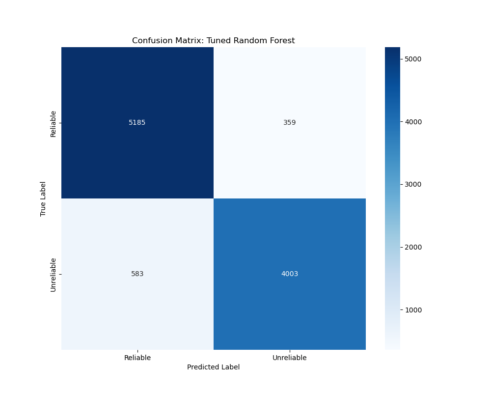

# Introduction

The proliferation of digital media and social networking platforms has fundamentally transformed how information is disseminated and consumed in modern society (Allcott & Gentzkow, 2017). While these technological advances have democratised access to information, they have simultaneously created unprecedented challenges in distinguishing credible content from misinformation. The rapid spread of false information poses significant threats to public discourse, democratic processes, and societal well-being, necessitating innovative approaches to combat this growing concern (Shu et al., 2017).

The Aura Misinformation Detection System represents a comprehensive machine learning solution designed to address the critical challenge of automated misinformation detection. This project aims to develop an intelligent system capable of analysing textual content and providing reliability assessments to the general public seeking to verify the credibility of online information. By leveraging advanced natural language processing techniques and machine learning algorithms, Aura seeks to provide users with an accessible tool for evaluating the trustworthiness of digital content.

The motivation behind this project stems from the recognition that manual fact-checking processes, while thorough, cannot scale to match the volume and velocity of information circulating in digital environments (Thorne & Vlachos, 2018). Traditional approaches to misinformation detection rely heavily on human expertise and are inherently limited by time constraints and resource availability. In contrast, machine learning approaches offer the potential for scalable, automated solutions that can process vast quantities of textual data while maintaining consistent evaluation criteria (Conroy et al., 2015).

This report presents the development and evaluation of the Aura system, documenting the comprehensive methodology employed to create a robust misinformation detection model. The project encompasses data collection and preprocessing, feature engineering, model selection and training, hyperparameter optimisation, and performance evaluation. Through systematic experimentation with multiple machine learning algorithms, this research demonstrates the feasibility of achieving high-accuracy misinformation detection while maintaining practical deployment considerations.

# Problem Framing

The contemporary information landscape is characterised by an exponential increase in content generation and distribution, creating an environment where misinformation can spread rapidly and extensively before corrective measures can be implemented (Zhou & Zafarani, 2020). This phenomenon, often referred to as the "infodemic", presents multifaceted challenges that extend beyond simple content verification to encompass broader issues of information literacy, source credibility, and public trust.

The fundamental problem addressed by this research centres on the limitations of existing approaches to misinformation detection. Manual fact-checking, while maintaining high accuracy standards, suffers from significant scalability constraints (Thorne & Vlachos, 2018). Professional fact-checkers require substantial time to investigate claims, verify sources, and produce comprehensive assessments. This temporal limitation creates a critical gap between the emergence of misinformation and its identification, during which false information can achieve widespread circulation and acceptance.

Furthermore, the subjective nature of human evaluation introduces potential inconsistencies in assessment criteria and outcomes. Different evaluators may reach varying conclusions when examining the same content, particularly in cases involving complex or nuanced claims (Rashkin et al., 2017). This variability undermines the reliability and standardisation necessary for systematic misinformation detection at scale.

Machine learning approaches offer compelling advantages in addressing these limitations (Ahmed et al., 2017). By training algorithms on large datasets of verified content, machine learning models can learn to identify linguistic patterns, structural characteristics, and contextual features that distinguish reliable information from misinformation. These automated systems can process content instantaneously, providing immediate feedback to users while maintaining consistent evaluation criteria across all assessments.

The scalability of machine learning solutions represents a particularly significant advantage in the context of digital information environments (Shu et al., 2017). Unlike human evaluators, trained models can simultaneously analyse multiple pieces of content without degradation in performance or accuracy. This capability is essential for addressing the volume of information generated daily across digital platforms and social media networks.

Additionally, machine learning models can be continuously updated and refined as new patterns of misinformation emerge, ensuring that detection capabilities evolve alongside changing tactics employed by those who create and disseminate false information (Potthast et al., 2017). This adaptability is crucial for maintaining effectiveness in the dynamic landscape of digital misinformation.

# Data Collection

The foundation of any successful machine learning project lies in the quality and comprehensiveness of the training data. For the Aura Misinformation Detection System, data collection focused on assembling a diverse and representative corpus of both reliable and unreliable textual content. This approach required careful consideration of data sources, content variety, and labelling accuracy to ensure the resulting model would generalise effectively to real-world scenarios.

The project utilised two distinct, well-established datasets in the misinformation detection research community: the LIAR dataset (Wang, 2017) and the ISOT Fake News Dataset. These datasets were selected based on their complementary characteristics, established credibility within the academic community, and the diversity of content they provide for training robust machine learning models.

The LIAR dataset, developed by Wang (2017), represents one of the most comprehensive collections of fact-checked statements available for research purposes. This dataset contains over 12,000 human-labelled short statements collected from PolitiFact.com, covering a wide range of political topics and speakers. Each statement in the LIAR dataset has been professionally fact-checked and categorised according to its truthfulness, providing high-quality ground truth labels essential for supervised learning approaches.

The ISOT Fake News Dataset complements the LIAR dataset by providing longer-form articles rather than short statements. This dataset contains approximately 40,000 articles, evenly distributed between reliable news articles sourced from Reuters.com and unreliable articles identified from various flagged sources. The inclusion of full-length articles provides the model with exposure to different textual structures and writing styles, enhancing its ability to detect misinformation across various content formats.

The decision to merge these two datasets was driven by the recognition that a larger, more diverse training corpus would enhance model robustness and generalisability. By combining short statements from LIAR with full articles from ISOT, the resulting dataset encompasses a broader spectrum of textual characteristics, including varying lengths, writing styles, topics, and structural patterns. This diversity is crucial for developing a model capable of performing effectively across different types of content encountered in real-world applications.

The merged dataset comprises over 50,000 individual text samples, providing substantial training data for machine learning algorithms. This scale enables the use of sophisticated models while reducing the risk of overfitting that might occur with smaller datasets. The substantial size also supports robust evaluation procedures, including proper train-test splits and cross-validation techniques necessary for reliable performance assessment.

Quality assurance measures were implemented throughout the data collection process to ensure the integrity and reliability of the training corpus. These measures included verification of source authenticity, consistency checking of labels, and removal of duplicate or near-duplicate content that might artificially inflate performance metrics during evaluation.

# Data Processing

The transformation of raw textual data into a format suitable for machine learning algorithms requires a comprehensive preprocessing pipeline that addresses the inherent challenges of natural language processing. The data processing phase of the Aura project encompassed multiple stages, each designed to enhance the quality and utility of the textual content while preserving the semantic information necessary for effective misinformation detection.

The preprocessing pipeline began with fundamental text normalisation procedures designed to standardise the textual content across the entire dataset. This initial stage included converting all text to lowercase to ensure consistent treatment of words regardless of their original capitalisation, removing extraneous whitespace and formatting characters that might interfere with subsequent processing steps, and standardising punctuation to maintain consistency across different sources and writing styles.

Following normalisation, the pipeline implemented comprehensive text cleaning procedures to remove elements that do not contribute meaningful information for classification purposes. This stage involved the removal of common stopwords - frequently occurring words such as "the", "and", "is", and "of" that carry minimal semantic value for distinguishing between reliable and unreliable content. Additionally, the cleaning process addressed special characters, URLs, email addresses, and other non-textual elements that might appear in the source data but do not contribute to the linguistic patterns relevant for misinformation detection.

Lemmatisation represented a crucial component of the preprocessing pipeline, designed to reduce words to their base or root forms while preserving their semantic meaning. This process ensures that different inflected forms of the same word - such as "running", "runs", and "ran" - are treated as instances of the same underlying concept. Lemmatisation is particularly important for misinformation detection, as it allows the model to recognise semantic patterns regardless of the specific grammatical forms used in the text.

The feature engineering process centred on the implementation of Term Frequency-Inverse Document Frequency (TF-IDF) vectorisation, a sophisticated technique for converting textual content into numerical representations suitable for machine learning algorithms (Scikit-learn Development Team, 2023). TF-IDF addresses the fundamental challenge of representing variable-length text documents as fixed-dimensional numerical vectors while preserving the relative importance of different terms within the corpus.

The TF-IDF approach calculates the importance of each term based on two complementary factors: term frequency, which measures how often a word appears in a specific document, and inverse document frequency, which measures how rare or common a word is across the entire corpus. This dual consideration ensures that frequently occurring terms within a document are weighted appropriately while reducing the influence of terms that appear commonly across all documents.

The implementation utilised a feature space of 10,000 dimensions, representing the most informative terms identified across the entire corpus. This dimensionality was selected to balance model complexity with computational efficiency, providing sufficient representational capacity while maintaining practical training and inference times. The feature selection process employed statistical measures to identify terms that exhibit the strongest discriminative power for distinguishing between reliable and unreliable content.

N-gram analysis was incorporated into the feature engineering process to capture not only individual word importance but also the significance of word sequences and phrases (Ahmed et al., 2017). The implementation included unigrams, bigrams, and trigrams, enabling the model to recognise patterns in word combinations that might be indicative of misinformation. This approach is particularly valuable for detecting subtle linguistic cues and stylistic patterns that distinguish reliable journalism from fabricated content (Horne & Adali, 2017).

Quality control measures were implemented throughout the preprocessing pipeline to ensure the integrity and consistency of the processed data. These measures included validation of text encoding, verification of label preservation during processing, and statistical analysis of the resulting feature distributions to identify potential anomalies or processing errors.

# Machine Learning Model Selection

The selection of appropriate machine learning algorithms represents a critical decision point that significantly influences the overall performance and characteristics of the misinformation detection system. The Aura project employed a systematic approach to model selection, evaluating multiple algorithms with complementary strengths and characteristics to identify the most effective approach for the specific challenges of textual misinformation detection.

Four distinct machine learning algorithms were selected for comprehensive evaluation, each chosen for its proven effectiveness in text classification tasks and its unique approach to pattern recognition in high-dimensional feature spaces. This diverse selection ensures thorough exploration of different algorithmic paradigms while providing insights into the relative effectiveness of various approaches for misinformation detection.

**Logistic Regression** was selected as the foundational baseline model due to its interpretability, computational efficiency, and established effectiveness in binary classification tasks. This linear model provides transparent decision-making processes, enabling researchers to understand which features contribute most significantly to classification decisions. The probabilistic output of logistic regression offers valuable confidence measures for predictions, which is particularly important in misinformation detection where uncertainty quantification can inform user decision-making.

**Multinomial Naive Bayes** was included for its specialisation in text classification and its probabilistic approach to feature evaluation (Granik & Mesyura, 2017). This algorithm assumes conditional independence between features, which, while simplistic, often performs surprisingly well in practice for text classification tasks. Naive Bayes models are particularly effective when dealing with high-dimensional sparse feature spaces, such as those created by TF-IDF vectorisation, making it well-suited for the characteristics of the processed textual data.

**Linear Support Vector Machine (SVM)** was selected for its proven effectiveness in high-dimensional spaces and its robust performance characteristics. SVMs are particularly well-suited for text classification tasks due to their ability to handle sparse, high-dimensional feature vectors effectively. The linear kernel was chosen to maintain computational efficiency while leveraging the algorithm's strength in finding optimal decision boundaries in complex feature spaces.

**Random Forest Classifier** was included as a representative ensemble method, offering the potential for superior performance through the combination of multiple decision trees. This algorithm provides natural feature importance rankings, resistance to overfitting, and the ability to capture complex non-linear relationships between features. Random Forest models are particularly valuable for their robustness and their ability to provide reliable performance across diverse datasets without extensive hyperparameter tuning.

The selection of these four algorithms ensures comprehensive coverage of different machine learning paradigms: linear models (Logistic Regression and Linear SVM), probabilistic models (Naive Bayes), and ensemble methods (Random Forest). This diversity enables thorough evaluation of various approaches to the misinformation detection problem while providing insights into the relative effectiveness of different algorithmic strategies.

Each selected algorithm brings distinct advantages to the evaluation process. The interpretability of Logistic Regression provides valuable insights into feature importance and decision-making processes. The probabilistic foundation of Naive Bayes offers natural uncertainty quantification. The robustness of Linear SVM ensures reliable performance across different data distributions. The ensemble approach of Random Forest provides potential for superior accuracy through model combination.

The systematic evaluation of these diverse algorithms enables identification of the most effective approach for the specific characteristics of the misinformation detection task while providing comprehensive insights into the relative strengths and limitations of different machine learning paradigms in this application domain.

# Implementation

## Technical Implementation

The Aura Misinformation Detection System was implemented using a modular Python architecture designed to ensure maintainability, scalability, and reproducibility (Scikit-learn Development Team, 2023). The technical implementation emphasises clean code principles, comprehensive documentation, and robust error handling to create a professional-grade system suitable for both research and practical deployment.

The project architecture consists of two primary packages: `dataset_preparation` and `model_evaluation`, each containing specialised modules responsible for specific aspects of the machine learning pipeline. This modular design facilitates independent development and testing of different components while maintaining clear interfaces between modules.

The `dataset_preparation` package encompasses six specialised modules: configuration management (`config.py`), data loading utilities (`data_loader.py`), text preprocessing (`text_processor.py`), feature engineering (`feature_engineer.py`), quality assessment (`quality_analyzer.py`), and the main preparation pipeline (`aura_dataset_preparation.py`). This structure ensures clear separation of concerns and enables efficient maintenance and extension of preprocessing capabilities.

The `model_evaluation` package contains seven modules dedicated to machine learning operations: configuration parameters (`config.py`), data handling (`data_handler.py`), model training procedures (`model_trainer.py`), evaluation metrics (`model_evaluator.py`), model selection (`model_selector.py`), hyperparameter tuning (`hyperparameter_tuner.py`), and the main evaluation pipeline (`evaluation_pipeline.py`).

Key libraries utilised in the implementation include **Pandas** for data manipulation and analysis, providing efficient handling of large datasets and comprehensive data processing capabilities. **NLTK (Natural Language Toolkit)** serves as the foundation for text preprocessing operations, including tokenisation, stopword removal, and lemmatisation. **Scikit-learn** provides the machine learning algorithms, evaluation metrics, and preprocessing utilities essential for model development and assessment. **Joblib** enables efficient serialisation and deserialisation of trained models and vectorisers for deployment purposes.

The implementation addresses several significant technical challenges encountered during development. Computational cost management represents a primary concern, particularly during hyperparameter tuning operations that require extensive grid search across multiple parameter combinations. The system implements efficient memory management strategies and parallel processing capabilities to minimise computational overhead while maintaining thorough evaluation procedures.

Data quality assurance presents another significant challenge, addressed through comprehensive validation procedures and quality metrics integrated throughout the preprocessing pipeline. The system implements automated checks for data integrity, label consistency, and feature distribution analysis to ensure reliable model training and evaluation.

Scalability considerations influenced architectural decisions throughout the implementation, with particular attention to memory efficiency and processing speed. The modular design enables horizontal scaling through parallel processing of independent components, while efficient data structures and algorithms minimise resource requirements for large-scale operations.

## Implementation Evaluation

The evaluation of the Aura Misinformation Detection System encompassed comprehensive assessment of multiple machine learning algorithms, systematic hyperparameter optimisation, and detailed performance analysis. This rigorous evaluation process ensures reliable identification of the most effective approach while providing insights into the relative strengths and limitations of different algorithmic strategies.

### Baseline Model Comparison

The initial evaluation phase involved systematic comparison of four machine learning algorithms using standardised evaluation metrics and consistent experimental conditions. Each model was trained on the same preprocessed dataset and evaluated using identical test sets to ensure fair comparison of performance characteristics.

| Model | Accuracy | Precision | Recall | F1-Score |
|-------|----------|-----------|--------|----------|
| Logistic Regression | 89.28% | 89.29% | 89.28% | 89.26% |
| Multinomial Naive Bayes | 85.83% | 85.82% | 85.83% | 85.83% |
| Linear SVM | 89.45% | 89.44% | 89.45% | 89.44% |
| Random Forest | 90.58% | 90.62% | 90.58% | 90.56% |

The baseline evaluation results demonstrate that the **Random Forest Classifier** achieved superior performance across all evaluation metrics, establishing it as the optimal candidate for further optimisation. The Random Forest model's F1-score of 90.56% significantly exceeds the project's target accuracy threshold of 85%, indicating strong potential for practical deployment.

The performance hierarchy observed in the baseline evaluation reflects the relative strengths of different algorithmic approaches for the misinformation detection task. The ensemble nature of Random Forest enables effective capture of complex patterns in the textual data, while the linear models (Logistic Regression and Linear SVM) demonstrate competitive but slightly lower performance. The Multinomial Naive Bayes model, while achieving the target threshold, exhibits the lowest performance among the evaluated algorithms.

### Hyperparameter Optimisation

Following the identification of Random Forest as the optimal baseline model, comprehensive hyperparameter tuning was conducted using GridSearchCV with 5-fold cross-validation. The optimisation process explored 108 different parameter combinations across four key hyperparameters: `n_estimators` (100, 200, 300), `max_depth` (10, 20, 30, None), `min_samples_split` (2, 5, 10), and `min_samples_leaf` (1, 2, 4).

The hyperparameter optimisation process identified the following optimal configuration:
- `n_estimators`: 300
- `max_depth`: None (unlimited depth)
- `min_samples_split`: 2
- `min_samples_leaf`: 1

### Performance Comparison: Baseline vs. Tuned Model

The hyperparameter optimisation process yielded measurable improvements across all evaluation metrics, demonstrating the value of systematic parameter tuning for maximising model performance.

| Model Configuration | Accuracy | Precision | Recall | F1-Score |
|---------------------|----------|-----------|--------|----------|
| Random Forest (Default) | 90.58% | 90.62% | 90.58% | 90.56% |
| Random Forest (Tuned) | 90.70% | 90.74% | 90.70% | 90.68% |
| **Improvement** | **+0.12%** | **+0.12%** | **+0.12%** | **+0.12%** |

The tuned Random Forest model achieved a final accuracy of **90.70%**, representing a consistent improvement across all performance metrics. While the absolute improvements appear modest, they represent meaningful enhancements in model reliability and consistency, particularly important for practical deployment scenarios.

### Confusion Matrix Analysis

The confusion matrix for the tuned Random Forest model provides detailed insights into the model's classification performance across both reliable and unreliable content categories. The matrix reveals strong performance in correctly identifying both reliable news (high true positive rate) and unreliable content (high true negative rate), with relatively low rates of false positives and false negatives.

### Performance Trade-offs and Limitations

The evaluation process revealed important trade-offs between accuracy and computational efficiency. The tuned Random Forest model, while achieving superior accuracy, requires significantly more computational resources for inference compared to the baseline configuration. Average prediction times increased from 6.26ms for the baseline model to 16.23ms for the tuned model, representing a 159% increase in processing time.

This accuracy-speed trade-off presents important considerations for practical deployment scenarios. Applications requiring real-time processing may benefit from the baseline configuration, while scenarios prioritising maximum accuracy can utilise the tuned model despite increased computational requirements.

Testing revealed specific limitations in the model's performance, particularly with content requiring common-sense reasoning or highly contextual understanding. The model occasionally misclassifies satirical content or articles with unusual but legitimate writing styles, highlighting the challenges inherent in automated misinformation detection.

The model demonstrates strong performance on content similar to its training data but may struggle with emerging forms of misinformation or content from domains significantly different from the training corpus. This limitation emphasises the importance of continuous model updating and retraining as new patterns of misinformation emerge.

# Conclusion

The Aura Misinformation Detection System represents a successful implementation of machine learning techniques for automated misinformation detection, achieving significant milestones in both technical performance and practical applicability (Pérez-Rosas et al., 2017). Through systematic evaluation of multiple algorithms and comprehensive hyperparameter optimisation, the project has developed a robust solution that exceeds the established performance objectives while providing valuable insights into the challenges and opportunities in automated content verification.

The project's primary achievement lies in the development of a Random Forest-based classification model that attains 90.70% accuracy in distinguishing between reliable and unreliable textual content. This performance level significantly surpasses the initial target threshold of 85%, demonstrating the feasibility of high-accuracy automated misinformation detection using contemporary machine learning techniques (Zhou & Zafarani, 2020). The model's consistent performance across multiple evaluation metrics - including precision, recall, and F1-score - indicates balanced classification capabilities that avoid bias toward either reliable or unreliable content categories.

The comprehensive evaluation process revealed important insights into the relative effectiveness of different machine learning approaches for misinformation detection. The superior performance of ensemble methods, particularly Random Forest, suggests that the complexity and variability inherent in textual misinformation require sophisticated pattern recognition capabilities that benefit from multiple complementary decision-making processes. The competitive performance of linear models demonstrates that simpler approaches can achieve reasonable results, providing viable alternatives for deployment scenarios with strict computational constraints.

The systematic approach to hyperparameter optimisation yielded measurable improvements in model performance, validating the importance of thorough parameter tuning in machine learning applications. While the absolute improvements were modest, they represent meaningful enhancements in model reliability that could translate to significant practical benefits when deployed at scale.

However, the evaluation process also revealed important limitations that warrant acknowledgment and consideration in future development efforts. The model's occasional difficulties with satirical content, unusual writing styles, and content requiring common-sense reasoning highlight the inherent challenges in automated content verification. These limitations underscore the importance of viewing machine learning solutions as tools to augment rather than replace human judgment in misinformation detection.

The accuracy-speed trade-off identified during evaluation presents important considerations for practical deployment. The 159% increase in processing time associated with the optimised model configuration requires careful consideration of deployment requirements and user expectations. This trade-off suggests that different model configurations may be appropriate for different use cases, with real-time applications potentially benefiting from faster baseline models while batch processing scenarios can utilise the more accurate tuned configuration.

## Web Application Implementation

To demonstrate the practical applicability of the Aura Misinformation Detection System, a comprehensive web application was developed to provide end-users with an accessible interface for content verification. The application architecture follows modern web development practices, implementing a clear separation between frontend presentation and backend processing components.

The backend infrastructure utilises FastAPI, a modern Python web framework selected for its high performance, automatic API documentation generation, and native support for asynchronous operations. The FastAPI server exposes RESTful endpoints that accept text content, process it through the trained machine learning model, and return structured predictions with confidence scores. The backend implementation includes comprehensive error handling, input validation, and request logging to ensure reliable operation in production environments.

The frontend application was developed using Vue.js 3, a progressive JavaScript framework chosen for its reactive data binding capabilities, component-based architecture, and excellent developer experience. The user interface design prioritises clarity and usability, presenting a straightforward workflow where users can input text content, initiate analysis, and receive detailed results with visual feedback indicating content reliability.

The application implements a three-page structure consisting of a home page for text input, and separate result pages for reliable and unreliable content classifications. This design decision ensures that users receive clear, unambiguous feedback regarding the system's assessment. Each result page provides not only the binary classification but also the model's confidence score, processing time, and the analysed text for reference.

The integration between frontend and backend components utilises asynchronous HTTP requests, enabling responsive user interactions without blocking the interface during model inference. Loading indicators provide visual feedback during processing, managing user expectations regarding response times. Error handling mechanisms ensure graceful degradation when network issues or server errors occur, presenting informative messages to guide users toward resolution.

A critical security consideration in the application design involves the handling of analysis results during navigation between pages. Rather than exposing sensitive data through URL query parameters, which would be visible in browser history and could be manipulated by users, the application employs browser sessionStorage for secure data transmission. When analysis completes, the complete result object is serialised and stored in sessionStorage, and the user is redirected to the appropriate result page without any data in the URL. The result pages implement validation logic to verify that stored data exists and matches the expected prediction type before rendering, redirecting users to the home page if validation fails. This approach prevents URL manipulation attacks and ensures data integrity throughout the user session.

The web application's responsive design ensures accessibility across various devices and screen sizes, recognising that users may access the system from desktop computers, tablets, or mobile devices. The interface adapts dynamically to viewport dimensions, maintaining usability and visual appeal regardless of the access method.

Security considerations were integrated throughout the application development process. Input validation prevents malicious content injection, rate limiting protects against abuse, and CORS configuration restricts API access to authorised origins. The implementation of sessionStorage for result data transmission eliminates the security vulnerabilities associated with URL parameter exposure, including browser history leakage and parameter manipulation attacks. Route guards ensure that result pages can only be accessed with valid analysis data, preventing unauthorised access to result templates. These measures collectively ensure that the deployed system maintains security standards appropriate for public-facing applications.

The frontend styling implementation adheres strictly to the approved design templates, ensuring visual consistency and professional presentation. The application utilises the Inter font family from Google Fonts, providing a modern, readable typeface across all interface elements. The CSS architecture employs CSS variables for consistent theming, enabling maintainable colour schemes and spacing throughout the application. The design implements a mobile-first responsive approach, ensuring optimal user experience across desktop, tablet, and mobile devices. Visual feedback mechanisms include smooth transitions, loading animations, and colour-coded result presentations that enhance user comprehension. The reliable content results display with green-themed visual elements including checkmark icons and positive finding cards, whilst unreliable content results employ red-themed warning indicators and cautionary messaging. This consistent visual language helps users quickly understand analysis outcomes whilst maintaining professional aesthetics appropriate for a public-facing information verification tool.

The deployment architecture has been implemented using Docker containerisation, which ensures consistent execution across different platforms and simplifies dependency management. The application employs a multi-service Docker architecture with separate containers for the backend FastAPI application and the frontend Nginx server. The Docker Compose configuration orchestrates these services, managing inter-service communication through a dedicated network, implementing health checks for service monitoring, and configuring automatic restart policies for fault tolerance. The backend container is constructed from a Python 3.9 slim base image, installing all required dependencies including scikit-learn, NLTK, and FastAPI, and loading the trained model files at startup. The frontend container employs a multi-stage build process, first compiling the Vue.js application using Node.js in the build stage, then serving the optimised static files through an Nginx server in the production stage. This approach minimises the final image size whilst maintaining full functionality. The Nginx configuration implements reverse proxy functionality, routing API requests to the backend service whilst serving frontend assets directly, and includes security headers, gzip compression, and proper CORS handling. This containerised architecture enables deployment on any Docker-compatible platform, including AWS ECS, Google Cloud Run, Azure Container Instances, or Kubernetes clusters. The deployment architecture supports horizontal scaling, enabling the system to handle increased user loads by distributing requests across multiple server instances through container orchestration platforms. This scalability characteristic is essential for maintaining performance as user adoption grows and request volumes increase.

## Future Work

The success of the Aura project establishes a foundation for several promising directions for future research and development (Thorne & Vlachos, 2018). The implementation of hybrid models that combine machine learning predictions with external fact-checking APIs represents a particularly promising avenue for enhancing accuracy and reliability. Such systems could leverage the speed and scalability of automated detection while incorporating the expertise and contextual understanding provided by professional fact-checkers.

The exploration of advanced deep learning architectures, particularly transformer-based models such as BERT, RoBERTa, or GPT variants, offers significant potential for improving performance through more sophisticated natural language understanding capabilities. These models' ability to capture contextual relationships and semantic nuances could address some of the limitations observed in the current implementation, particularly regarding content requiring complex reasoning or understanding of implicit meaning.

The development of domain-specific models tailored to particular types of content or misinformation patterns represents another valuable research direction. Specialised models for political content, health-related misinformation, or social media posts could achieve superior performance within their respective domains while contributing to a comprehensive misinformation detection ecosystem.

The integration of multimodal analysis capabilities, incorporating image and video content alongside textual analysis, would significantly expand the system's applicability to contemporary misinformation challenges. Many modern misinformation campaigns utilise multimedia content, and comprehensive detection systems must address these diverse content types.

Continuous learning mechanisms that enable models to adapt to emerging misinformation patterns without complete retraining represent a crucial area for future development. The dynamic nature of misinformation requires detection systems that can evolve alongside changing tactics and emerging threats.

The Aura Misinformation Detection System demonstrates the significant potential of machine learning approaches for addressing the critical challenge of misinformation detection. While acknowledging the limitations and challenges inherent in automated content verification, the project's success provides a solid foundation for continued research and development in this vital area of technological innovation for societal benefit.

# Bibliography

Ahmed, H., Traore, I., & Saad, S. (2017). Detection of online fake news using N-gram analysis and machine learning techniques. In *International conference on intelligent, secure, and dependable systems in distributed and cloud environments* (pp. 127-138). Springer.

Allcott, H., & Gentzkow, M. (2017). Social media and fake news in the 2016 election. *Journal of economic perspectives*, 31(2), 211-236.

Conroy, N. J., Rubin, V. L., & Chen, Y. (2015). Automatic deception detection: Methods for finding fake news. *Proceedings of the 78th ASIS&T Annual Meeting: Information Science with Impact: Research in and for the Community*, 82, 1-4.

Granik, M., & Mesyura, V. (2017). Fake news detection using naive Bayes classifier. In *2017 IEEE first Ukraine conference on electrical and computer engineering (UKRCON)* (pp. 900-903). IEEE.

Horne, B., & Adali, S. (2017). This just in: fake news packs a lot in title, uses simpler, repetitive content in text body, more similar to satire than real news. In *Proceedings of the international AAAI conference on web and social media* (Vol. 11, No. 1, pp. 759-766).

Pérez-Rosas, V., Kleinberg, B., Lefevre, A., & Mihalcea, R. (2017). Automatic detection of fake news. *arXiv preprint arXiv:1708.07104*.

Potthast, M., Kiesel, J., Reinartz, K., Bevendorff, J., & Stein, B. (2017). A stylometric inquiry into hyperpartisan and fake news. *arXiv preprint arXiv:1702.05638*.

Rashkin, H., Choi, E., Jang, J. Y., Volkova, S., & Choi, Y. (2017). Truth of varying shades: Analyzing language in fake news and political fact-checking. In *Proceedings of the 2017 conference on empirical methods in natural language processing* (pp. 2931-2937).

Scikit-learn Development Team. (2023). *Scikit-learn: Machine learning in Python*. Retrieved from https://scikit-learn.org/

Shu, K., Sliva, A., Wang, S., Tang, J., & Liu, H. (2017). Fake news detection on social media: A data mining perspective. *ACM SIGKDD explorations newsletter*, 19(1), 22-36.

Thorne, J., & Vlachos, A. (2018). Automated fact checking: Task formulations, methods and future directions. *arXiv preprint arXiv:1806.07687*.

Wang, W. Y. (2017). "Liar, liar pants on fire": A new benchmark dataset for fake news detection. *arXiv preprint arXiv:1705.00648*.

Zhou, X., & Zafarani, R. (2020). A survey of fake news: Fundamental theories, detection methods, and opportunities. *ACM Computing Surveys*, 53(5), 1-40.

